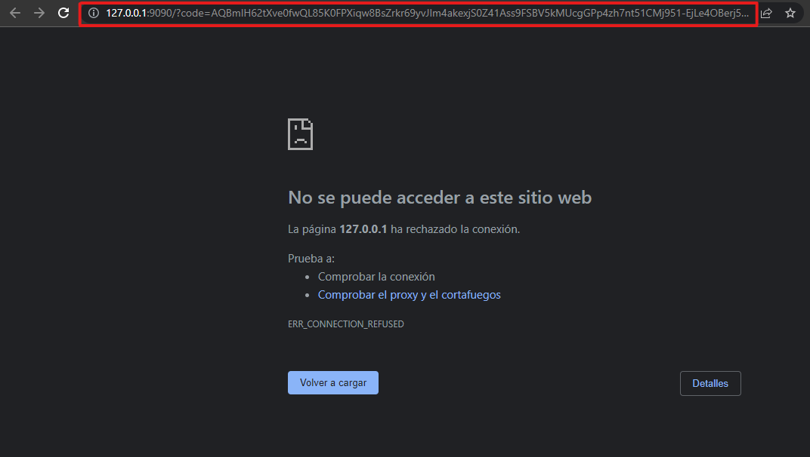
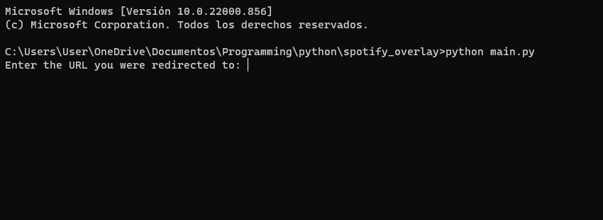

# Spotify song notifier

it shows a popup/notification every time you start a new song in spotify that shows the song name, author(s) and cover


## how to use

go to the [spotify for devs dashboard](https://developer.spotify.com/dashboard/applications) and create an app to get the client ID and client secret

...

create a file named keys.json and add your client id and client secret

```
{
    "CLIENT_ID": "xxxxxxxxxxxxxxxxxxxxxxxx",
    "CLIENT_SECRET": "yyyyyyyyyyyyyyyyyyyyyyyyyyyyyyyy"
}
```

## First-time run

at the first time you open the program (if it doesn't crash xd), you will be redirected to a spotify login, and after that, an error screen should appear, copy the url and then paste it on the terminal





after that, the program should notify you when a new song starts

(only god knows what my code does by now so the program could probably don't work)
